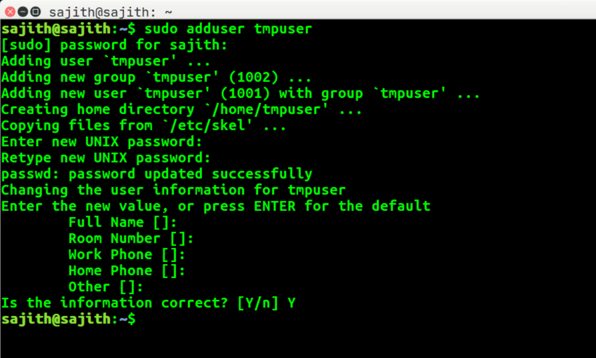
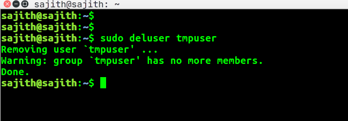

### How to configure user environment variables in Linux(Ubuntu)

#### Create a new user in Ubuntu
```
# sudo adduser <username>
sudo adduser tmpuser
```


#### Delete a existing user in Ubuntu
```
# sudo deluser <username>
sudo deluser tmpuser
```

