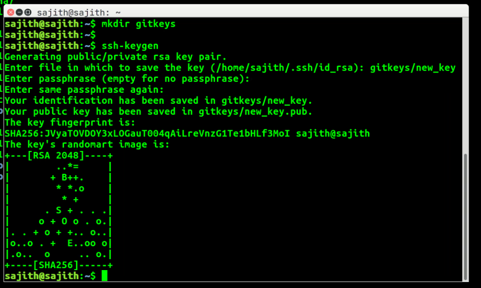
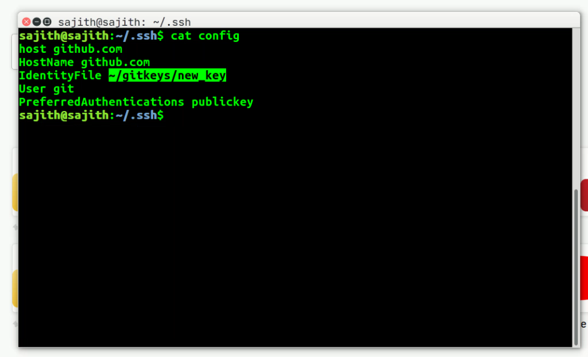

### How to add new ssh key for your github account
#### Step 01: Please create a ssh key from your Linux terminal or Git bash in Windows 
```
mkdir $HOME/gitkeys
ssh-keygen
```


#### Step 02: Configure newly created ssh key in ssh config file. Following is my sample config
```
host github.com
HostName github.com
IdentityFile ~/gitkeys/new_key
User git
PreferredAuthentications publickey
```

